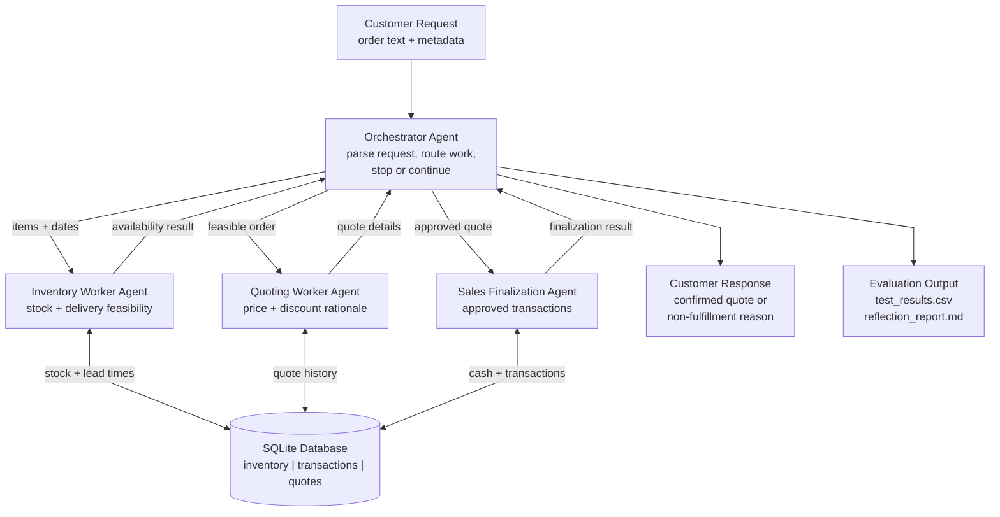

# Munder Difflin Agent Workflow Diagram

## 1. Orchestration And Data Flow

## 2. Agent Responsibilities And Tools

```mermaid
%%{init: {"flowchart": {"curve": "linear", "nodeSpacing": 50, "rankSpacing": 70}} }%%
flowchart TB
    subgraph ORCH["Orchestrator Agent"]
        direction LR
        OR["Responsibilities<br>parse requests<br>resolve catalog names<br>delegate worker tasks<br>compose final response"]
        OT["orchestration_summary_tool<br>Purpose: describe routing<br>Helpers: none"]
        OR --> OT
    end

    subgraph INV["Inventory Worker Agent"]
        direction LR
        IR["Responsibilities<br>check stock<br>assess shortages<br>estimate supplier timing<br>decide delivery feasibility"]
        IT1["inventory_snapshot_tool<br>Purpose: inventory snapshot<br>Helper: get_all_inventory"]
        IT2["assess_inventory_for_order_tool<br>Purpose: stock + restock check<br>Helpers: get_all_inventory<br>get_stock_level<br>get_supplier_delivery_date"]
        IR --> IT1
        IR --> IT2
    end

    subgraph QUOTE["Quoting Worker Agent"]
        direction LR
        QR["Responsibilities<br>calculate quote<br>apply volume discount<br>use historical context<br>explain price rationale"]
        QT["generate_quote_tool<br>Purpose: quote + discount<br>Helper: search_quote_history"]
        QR --> QT
    end

    subgraph SALES["Sales Finalization Agent"]
        direction LR
        SR["Responsibilities<br>check operating cash<br>record supplier orders<br>record customer sales<br>return final financial state"]
        ST["finalize_sale_tool<br>Purpose: finalize approved order<br>Helpers: get_cash_balance<br>create_transaction<br>generate_financial_report"]
        SR --> ST
    end
```

## Responsibility Boundaries

| Agent | Non-overlapping responsibility | Tools |
| --- | --- | --- |
| Orchestrator Agent | Controls the workflow, parses the request, delegates work, and decides whether to continue or stop. | `orchestration_summary_tool` |
| Inventory Worker Agent | Checks inventory availability, supplier restock needs, and delivery feasibility. Does not price or finalize sales. | `inventory_snapshot_tool`, `assess_inventory_for_order_tool` |
| Quoting Worker Agent | Produces quote totals, discount rationale, and historical quote context. Does not mutate inventory or cash. | `generate_quote_tool` |
| Sales Finalization Agent | Records approved stock-order and sales transactions. Does not decide product matching or pricing. | `finalize_sale_tool` |

## Tool And Helper Mapping

| Tool | Agent | Purpose | Starter helper functions used |
| --- | --- | --- | --- |
| `inventory_snapshot_tool` | Inventory Worker | Returns positive stock levels for an as-of date. | `get_all_inventory` |
| `assess_inventory_for_order_tool` | Inventory Worker | Checks stock, shortage quantity, supplier delivery date, and deadline feasibility. | `get_all_inventory`, `get_stock_level`, `get_supplier_delivery_date` |
| `generate_quote_tool` | Quoting Worker | Calculates subtotal, volume discount, final total, and pricing explanation. | `search_quote_history` |
| `finalize_sale_tool` | Sales Finalization Agent | Checks cash, creates supplier stock-order transactions, creates customer sales transactions, and returns the final financial state. | `get_cash_balance`, `create_transaction`, `generate_financial_report` |
| `orchestration_summary_tool` | Orchestrator | Documents the routing logic used by the orchestrator. | None |

